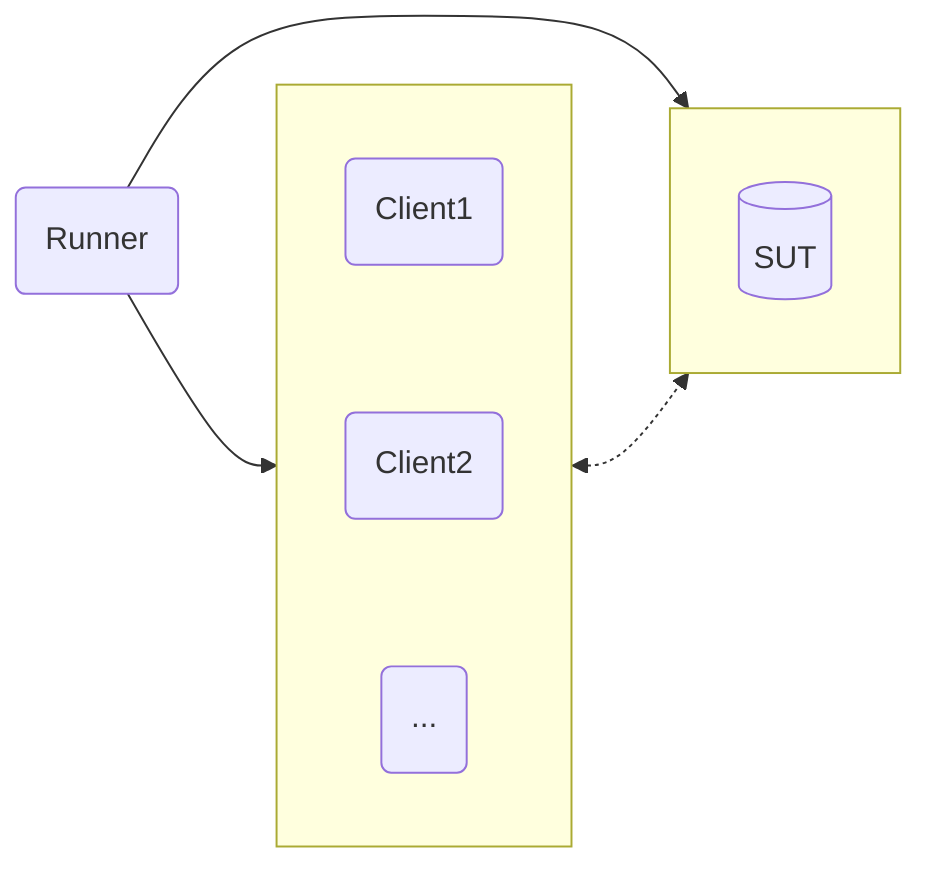

# Ampere Performance Toolkit

Ampere Performance Toolkit (APT) is a fork of PerfKitBenchmarker from GCP: https://github.com/GoogleCloudPlatform/PerfKitBenchmarker

- APT Version: 1.0.0
- Upstream Google PerfKitBenchmarker commit SHA: 0fc45c45a25657aa0634ae06cace08cb79e7803b

Features Added

- Oracle Cloud Infrastructure (OCI) support as a provider
    - APT can automatically provision/cleanup VMs, VCNs, etc. through OCI for workload runs
- Additional support for BareMetal testing
- IRQ binding for experimentation with network intensive workloads
- A global tuning module that enables declarative bash commands from yaml configs on all systems involved in a test
- Max throughput mode for key workloads to determine the best throughput possible under a given SLA

In summary, APT is great at capturing all workload parameters and system-under-test parameters in a single, re-playable,
yaml file.

- See [Contribution Guide](ampere/pkb/docs/CONTRIBUTING.md) for issues, features requests, and questions 
- See [Guides](ampere/pkb/docs/guides) for various guides, tips, and tricks

# Licensing

Ampere Performance Toolkit provides wrappers and workload definitions around popular
benchmark tools. We made it very simple to use and automate everything we can.
It instantiates VMs on the Cloud provider of your choice, automatically installs
benchmarks, and runs the workloads without user interaction.

Due to the level of automation you will not see prompts for software installed
as part of a benchmark run. Therefore you must accept the license of each of the
benchmarks individually, and take responsibility for using them before you use
the Ampere Performance Toolkit. 

In its current release these are the benchmarks that are executed and their associated license terms:

- `cassandra`: [Apache v2](https://github.com/apache/cassandra/blob/trunk/LICENSE.txt)
- `tlp-stress`: [Apache v2](https://github.com/thelastpickle/tlp-stress/blob/master/LICENSE.txt)
- `ffmpeg`: [LGPL with optional components licensed under GPL](https://github.com/FFmpeg/FFmpeg/blob/master/LICENSE.md)
- `memtier_benchmark`: [GPL v2](https://github.com/RedisLabs/memtier_benchmark?tab=GPL-2.0-1-ov-file)
- `mysql`: [GPL v2](https://github.com/mysql/mysql-server/blob/trunk/LICENSE)
- `nginx`: [BSD-2-Clause](https://github.com/nginx/nginx/blob/master/LICENSE)
- `openssl`: [Apache v2](https://github.com/openssl/openssl/blob/master/LICENSE.txt)
- `redis`: Dual-licensing model with [RSALv2 and SSPLv1](https://github.com/redis/redis/blob/unstable/LICENSE.txt)
- `sysbench`: [GPL v2](https://github.com/akopytov/sysbench?tab=GPL-2.0-1-ov-file#readme)
- `wrk`: [Apache v2](https://github.com/wg/wrk/blob/master/LICENSE)

# APT: Overview, Setup, and Usage

## Overview

APT runs on a separate system from the system-under-test (SUT), and sends commands over SSH to the SUT to perform benchmarks. The steps in this guide will help to prepare a new APT runner system.

### Test Topology

A minimum of 2+ systems is required for APT. 

The simplest configuration would consist of one runner system and one system-under-test (SUT) for single-node tests. 

A more involved configuration might consist of one runner system, one SUT, and one or more clients (depending on the workload).



### Prerequisites
*For BareMetal / Static VM Tests*
- Passwordless SSH configured
  - Runner -> SUT
  - Runner -> Client(s)
  - See [here](ampere/pkb/docs/guides/passwordless-ssh.md) for more details
- Passwordless sudo granted to user on...
  - SUT
  - Client(s)
  - Required for package installation / builds
- Firewall disabled between SUT and Client(s)

*For Cloud-based Tests*
- APT will automatically create the system(s) and SSH keys required for connection under the hood (given a valid cloud YAML config) 


## Dependencies

APT requires Python 3.11 and above, pip for package management, and a virtual environment for dependencies. Check the current version on your runner system with `python3 --version`. 

If the system does not already have Python 3.11 or higher, install it explicitly, e.g. *Fedora 38*

```bash
sudo dnf install python3.11
```

## Setup APT

Create a new virtual environment

```bash
python3.11 -m venv apt_venv
```

Start the virtual environment

```bash
source apt_venv/bin/activate
```

Upgrade pip inside virtual environment (important)

```bash
python3.11 -m pip install --upgrade pip
```

Clone the Ampere Performance Toolkit (APT) repository 

Next, `cd` into the root of project directory

Then, install requirements (while venv is running!)

```bash
pip install -r requirements.txt
```

- There may be a warning during install about "timeout-decorator being installed using legacy 'setup.py install' method", which is safe to ignore 


## Usage

### The 5 Stages of a PerfKitBenchmarker run


To initiate all phases, simply call APT with the workload and config of your choice. Run from the root of the project directory and be sure the virtual envirnoment is active.

```bash
./pkb.py --benchmarks=<benchmark_name> --benchmark_config_file=<path_to_config>
```

e.g. to run NGINX and wrk with an existing YAML config
```bash
./pkb.py --benchmarks=ampere_nginx_wrk --benchmark_config_file=./ampere/pkb/configs/example_nginx.yml
```

For more details about setting up a BareMetal run, see the [BareMetal Getting Started Guide](ampere/pkb/docs/guides/baremetal-getting-started.md)

For more details about setting up cloud-based runs on OCI, see the [OCI Getting Started Guide](ampere/pkb/docs/guides/oci-getting-started.md)

**YAML Configs**

Each YAML config file represents a workload configuration for a certain system(s) and environment
- The path to the configuration file in the run command can be relative or absolute
- The benchmark name must match the name defined in the YAML config

### A few useful PerfKitBenchmarker flags

| Flag | Description |
| ---- | ----------- |
| `--run_stage_iterations=<n>` | Execute the run stage N times in a row |
| `--run_stage=<provision,prepare,run,cleanup,teardown>` | Run in stages, useful for monitoring/debugging between runs |
|`--helpmatch=ampere`|Searches and matches any flag that has been implemented by Ampere with a description on how to use it. You can use the `.` notation to drill down in to specific flags you're interested in. E.G. `./pkb.py --helpmatch=ampere.pkb.linux_packages.redis` will return all the associated `ampere_redis_server` flags for running `ampere_redis_memtier`|

Usage example:
1. Pass `--run_stage=provision,prepare`
2. Save the `run_uri` generated at the end of this first pass
3. Connect to SUT for debugging/monitoring
4. Pass `--run_stage=run --run_uri=<run_uri>` to repeat testing manually N times
5. Pass `--run_stage=cleanup,teardown --run_uri<run_uri>` when ready to finish

## Results

To deactivate virtual environment

`deactivate`

All test results, logs, Ampere System Dump results, etc. can be found in

`/tmp/perfkitbenchmarker/runs/<run_uri>`

This directory (with correct run_uri) will be output to the console at the end of each test run.

<<<<<<< HEAD
=======
```bash
./pkb.py --cloud=CloudStack --benchmarks=ping --cs_network_offering=DefaultNetworkOffering
```

## Example run on Rackspace

```bash
$ ./pkb.py --cloud=Rackspace --machine_type=general1-2 --benchmarks=iperf
```

## Example run on ProfitBricks

```bash
$ ./pkb.py --cloud=ProfitBricks --machine_type=Small --benchmarks=iperf
```

# How to Run Windows Benchmarks

Install all dependencies as above and ensure that smbclient is installed on your
system if you are running on a linux controller:

```bash
$ which smbclient
/usr/bin/smbclient
```

Now you can run Windows benchmarks by running with `--os_type=windows`. Windows
has a different set of benchmarks than Linux does. They can be found under
[`perfkitbenchmarker/windows_benchmarks/`](perfkitbenchmarker/windows_benchmarks).
The target VM OS is Windows Server 2012 R2.

# How to Run Benchmarks with Juju

[Juju](https://jujucharms.com/) is a service orchestration tool that enables you
to quickly model, configure, deploy and manage entire cloud environments.
Supported benchmarks will deploy a Juju-modeled service automatically, with no
extra user configuration required, by specifying the `--os_type=juju` flag.

## Example

```bash
$ ./pkb.py --cloud=AWS --os_type=juju --benchmarks=cassandra_stress
```

## Benchmark support

Benchmark/Package authors need to implement the JujuInstall() method inside
their package. This method deploys, configures, and relates the services to be
benchmarked. Please note that other software installation and configuration
should be bypassed when `FLAGS.os_type == JUJU`. See
[`perfkitbenchmarker/linux_packages/cassandra.py`](perfkitbenchmarker/linux_packages/cassandra.py)
for an example implementation.

# How to Run All Standard Benchmarks

Run with `--benchmarks="standard_set"` and every benchmark in the standard set
will run serially which can take a couple of hours. Additionally, if you don't
specify `--cloud=...`, all benchmarks will run on the Google Cloud Platform.

# How to Run All Benchmarks in a Named Set

Named sets are are groupings of one or more benchmarks in the benchmarking
directory. This feature allows parallel innovation of what is important to
measure in the Cloud, and is defined by the set owner. For example the GoogleSet
is maintained by Google, whereas the StanfordSet is managed by Stanford. Once a
quarter a meeting is held to review all the sets to determine what benchmarks
should be promoted to the `standard_set`. The Standard Set is also reviewed to
see if anything should be removed. To run all benchmarks in a named set, specify
the set name in the benchmarks parameter (e.g., `--benchmarks="standard_set"`).
Sets can be combined with individual benchmarks or other named sets.

# Running selective stages of a benchmark

This procedure demonstrates how to run only selective stages of a benchmark.
This technique can be useful for examining a machine after it has been prepared,
but before the benchmark runs.

This example shows how to provision and prepare the `cluster_boot` benchmark
without actually running the benchmark.

1.  Change to your local version of PKB: `cd $HOME/PerfKitBenchmarker`

1.  Run provision, prepare, and run stages of `cluster_boot`.

    ```
    ./pkb.py --benchmarks=cluster_boot --machine_type=n1-standard-2 --zones=us-central1-f --run_stage=provision,prepare,run
    ```

1.  The output from the console will tell you the run URI for your benchmark.
    Try to ssh into the VM. The machine "Default-0" came from the VM group which
    is specified in the benchmark_config for cluster_boot.

    ```
    ssh -F /tmp/perfkitbenchmarker/runs/<run_uri>/ssh_config default-0
    ```

1.  Now that you have examined the machines, teardown the instances that were
    made and cleanup.

    ```
    ./pkb.py --benchmarks=cluster_boot --run_stage=teardown -run_uri=<run_uri>
    ```

# Useful Global Flags

The following are some common flags used when configuring PerfKit Benchmarker.

Flag               | Notes
------------------ | -----
`--helpmatch=pkb`  | see all global flags
`--helpmatch=hpcc` | see all flags associated with the hpcc benchmark. You can substitute any benchmark name to see the associated flags.
`--benchmarks`     | A comma separated list of benchmarks or benchmark sets to run such as `--benchmarks=iperf,ping` . To see the full list, run `./pkb.py --helpmatch=benchmarks
`--cloud`          | Cloud where the benchmarks are run. See the table below for choices.
`--machine_type`   | Type of machine to provision if pre-provisioned machines are not used. Most cloud providers accept the names of pre-defined provider-specific machine types (for example, GCP supports `--machine_type=n1-standard-8` for a GCE n1-standard-8 VM). Some cloud providers support YAML expressions that match the corresponding VM spec machine_type property in the [YAML configs](#configurations-and-configuration-overrides) (for example, GCP supports `--machine_type="{cpus: 1, memory: 4.5GiB}"` for a GCE custom VM with 1 vCPU and 4.5GiB memory). Note that the value provided by this flag will affect all provisioned machines; users who wish to provision different machine types for different roles within a single benchmark run should use the [YAML configs](#configurations-and-configuration-overrides) for finer control.
`--zones`          | This flag allows you to override the default zone. See the table below.
`--data_disk_type` | Type of disk to use. Names are provider-specific, but see table below.

The default cloud is 'GCP', override with the `--cloud` flag. Each cloud has a
default zone which you can override with the `--zones` flag, the flag supports
the same values that the corresponding Cloud CLIs take:

Cloud name   | Default zone  | Notes
------------ | ------------- | -----
GCP          | us-central1-a |
AWS          | us-east-1a    |
Azure        | eastus2       |
IBMCloud     | us-south-1    |
AliCloud     | West US       |
DigitalOcean | sfo1          | You must use a zone that supports the features 'metadata' (for cloud config) and 'private_networking'.
OpenStack    | nova          |
CloudStack   | QC-1          |
Rackspace    | IAD           | OnMetal machine-types are available only in IAD zone
Kubernetes   | k8s           |
ProfitBricks | AUTO          | Additional zones: ZONE_1, ZONE_2, or ZONE_3

Example:

```bash
./pkb.py --cloud=GCP --zones=us-central1-a --benchmarks=iperf,ping
```

The disk type names vary by provider, but the following table summarizes some
useful ones. (Many cloud providers have more disk types beyond these options.)

Cloud name | Network-attached SSD | Network-attached HDD
---------- | -------------------- | --------------------
GCP        | pd-ssd               | pd-standard
AWS        | gp3                  | st1
Azure      | Premium_LRS          | Standard_LRS
Rackspace  | cbs-ssd              | cbs-sata

Also note that `--data_disk_type=local` tells PKB not to allocate a separate
disk, but to use whatever comes with the VM. This is useful with AWS instance
types that come with local SSDs, or with the GCP `--gce_num_local_ssds` flag.

If an instance type comes with more than one disk, PKB uses whichever does *not*
hold the root partition. Specifically, on Azure, PKB always uses `/dev/sdb` as
its scratch device.

## Proxy configuration for VM guests.

If the VM guests do not have direct Internet access in the cloud environment,
you can configure proxy settings through `pkb.py` flags.

To do that simple setup three flags (All urls are in notation ): The flag values
use the same `<protocol>://<server>:<port>` syntax as the corresponding
environment variables, for example `--http_proxy=http://proxy.example.com:8080`
.

Flag            | Notes
--------------- | -----
`--http_proxy`  | Needed for package manager on Guest OS and for some Perfkit packages
`--https_proxy` | Needed for package manager or Ubuntu guest and for from github downloaded packages
`--ftp_proxy`   | Needed for some Perfkit packages

## Preprovisioned Data

As mentioned above, some benchmarks require preprovisioned data. This section
describes how to preprovision this data.

### Benchmarks with Preprovisioned Data

#### Sample Preprovision Benchmark

This benchmark demonstrates the use of preprovisioned data. Create the following
file to upload using the command line:

```bash
echo "1234567890" > preprovisioned_data.txt
```

To upload, follow the instructions below with a filename of
`preprovisioned_data.txt` and a benchmark name of `sample`.

### Clouds with Preprovisioned Data

#### Google Cloud

To preprovision data on Google Cloud, you will need to upload each file to
Google Cloud Storage using gsutil. First, you will need to create a storage
bucket that is accessible from VMs created in Google Cloud by PKB. Then copy
each file to this bucket using the command

```bash
gsutil cp <filename> gs://<bucket>/<benchmark-name>/<filename>
```

To run a benchmark on Google Cloud that uses the preprovisioned data, use the
flag `--gcp_preprovisioned_data_bucket=<bucket>`.

#### AWS

To preprovision data on AWS, you will need to upload each file to S3 using the
AWS CLI. First, you will need to create a storage bucket that is accessible from
VMs created in AWS by PKB. Then copy each file to this bucket using the command

```bash
aws s3 cp <filename> s3://<bucket>/<benchmark-name>/<filename>
```

To run a benchmark on AWS that uses the preprovisioned data, use the flag
`--aws_preprovisioned_data_bucket=<bucket>`.

# Configurations and Configuration Overrides

Each benchmark now has an independent configuration which is written in YAML.
Users may override this default configuration by providing a configuration. This
allows for much more complex setups than previously possible, including running
benchmarks across clouds.

A benchmark configuration has a somewhat simple structure. It is essentially
just a series of nested dictionaries. At the top level, it contains VM groups.
VM groups are logical groups of homogenous machines. The VM groups hold both a
`vm_spec` and a `disk_spec` which contain the parameters needed to create
members of that group. Here is an example of an expanded configuration:

```yaml
hbase_ycsb:
  vm_groups:
    loaders:
      vm_count: 4
      vm_spec:
        GCP:
          machine_type: n1-standard-1
          image: ubuntu-16-04
          zone: us-central1-c
        AWS:
          machine_type: m3.medium
          image: ami-######
          zone: us-east-1a
        # Other clouds here...
      # This specifies the cloud to use for the group. This allows for
      # benchmark configurations that span clouds.
      cloud: AWS
      # No disk_spec here since these are loaders.
    master:
      vm_count: 1
      cloud: GCP
      vm_spec:
        GCP:
          machine_type:
            cpus: 2
            memory: 10.0GiB
          image: ubuntu-16-04
          zone: us-central1-c
        # Other clouds here...
      disk_count: 1
      disk_spec:
        GCP:
          disk_size: 100
          disk_type: standard
          mount_point: /scratch
        # Other clouds here...
    workers:
      vm_count: 4
      cloud: GCP
      vm_spec:
        GCP:
          machine_type: n1-standard-4
          image: ubuntu-16-04
          zone: us-central1-c
        # Other clouds here...
      disk_count: 1
      disk_spec:
        GCP:
          disk_size: 500
          disk_type: remote_ssd
          mount_point: /scratch
        # Other clouds here...
```

For a complete list of keys for `vm_spec`s and `disk_spec`s see
[`virtual_machine.BaseVmSpec`](https://github.com/GoogleCloudPlatform/PerfKitBenchmarker/blob/master/perfkitbenchmarker/virtual_machine.py)
and
[`disk.BaseDiskSpec`](https://github.com/GoogleCloudPlatform/PerfKitBenchmarker/blob/master/perfkitbenchmarker/disk.py)
and their derived classes.

User configs are applied on top of the existing default config and can be
specified in two ways. The first is by supplying a config file via the
`--benchmark_config_file` flag. The second is by specifying a single setting to
override via the `--config_override` flag.

A user config file only needs to specify the settings which it is intended to
override. For example if the only thing you want to do is change the number of
VMs for the `cluster_boot` benchmark, this config is sufficient:

```yaml
cluster_boot:
  vm_groups:
    default:
      vm_count: 100
```

You can achieve the same effect by specifying the `--config_override` flag. The
value of the flag should be a path within the YAML (with keys delimited by
periods), an equals sign, and finally the new value:

```bash
--config_override=cluster_boot.vm_groups.default.vm_count=100
```

See the section below for how to use static (i.e. pre-provisioned) machines in
your config.

# Advanced: How To Run Benchmarks Without Cloud Provisioning (e.g., local workstation)

It is possible to run PerfKit Benchmarker without running the Cloud provisioning
steps. This is useful if you want to run on a local machine, or have a benchmark
like iperf run from an external point to a Cloud VM.

In order to do this you need to make sure:

*   The static (i.e. not provisioned by PerfKit Benchmarker) machine is ssh'able
*   The user PerfKitBenchmarker will login as has 'sudo' access. (*** Note we
    hope to remove this restriction soon ***)

Next, you will want to create a YAML user config file describing how to connect
to the machine as follows:

```yaml
static_vms:
  - &vm1 # Using the & character creates an anchor that we can
         # reference later by using the same name and a * character.
    ip_address: 170.200.60.23
    user_name: voellm
    ssh_private_key: /home/voellm/perfkitkeys/my_key_file.pem
    zone: Siberia
    disk_specs:
      - mount_point: /data_dir
```

*   The `ip_address` is the address where you want benchmarks to run.
*   `ssh_private_key` is where to find the private ssh key.
*   `zone` can be anything you want. It is used when publishing results.
*   `disk_specs` is used by all benchmarks which use disk (i.e., `fio`,
    `bonnie++`, many others).

In the same file, configure any number of benchmarks (in this case just iperf),
and reference the static VM as follows:

```yaml
iperf:
  vm_groups:
    vm_1:
      static_vms:
        - *vm1
```

I called my file `iperf.yaml` and used it to run iperf from Siberia to a GCP VM
in us-central1-f as follows:

```bash
$ ./pkb.py --benchmarks=iperf --machine_type=f1-micro --benchmark_config_file=iperf.yaml --zones=us-central1-f --ip_addresses=EXTERNAL
```

*   `ip_addresses=EXTERNAL` tells PerfKit Benchmarker not to use 10.X (ie
    Internal) machine addresses that all Cloud VMs have. Just use the external
    IP address.

If a benchmark requires two machines like iperf, you can have two machines in
the same YAML file as shown below. This means you can indeed run between two
machines and never provision any VMs in the Cloud.

```yaml
static_vms:
  - &vm1
    ip_address: <ip1>
    user_name: connormccoy
    ssh_private_key: /home/connormccoy/.ssh/google_compute_engine
    internal_ip: 10.240.223.37
    install_packages: false
  - &vm2
    ip_address: <ip2>
    user_name: connormccoy
    ssh_private_key: /home/connormccoy/.ssh/google_compute_engine
    internal_ip: 10.240.234.189
    ssh_port: 2222

iperf:
  vm_groups:
    vm_1:
      static_vms:
        - *vm2
    vm_2:
      static_vms:
        - *vm1
```

# Specifying Flags in Configuration Files

You can now specify flags in configuration files by using the `flags` key at the
top level in a benchmark config. The expected value is a dictionary mapping flag
names to their new default values. The flags are only defaults; it's still
possible to override them via the command line. It's even possible to specify
conflicting values of the same flag in different benchmarks:

```yaml
iperf:
  flags:
    machine_type: n1-standard-2
    zone: us-central1-b
    iperf_sending_thread_count: 2

netperf:
  flags:
    machine_type: n1-standard-8
```

The new defaults will only apply to the benchmark in which they are specified.

# Using Elasticsearch Publisher

PerfKit data can optionally be published to an Elasticsearch server. To enable
this, the `elasticsearch` Python package must be installed.

```bash
$ pip install elasticsearch
```

Note: The `elasticsearch` Python library and Elasticsearch must have matching
major versions.

The following are flags used by the Elasticsearch publisher. At minimum, all
that is needed is the `--es_uri` flag.

Flag         | Notes
------------ | -----
`--es_uri`   | The Elasticsearch server address and port (e.g. localhost:9200)
`--es_index` | The Elasticsearch index name to store documents (default: perfkit)
`--es_type`  | The Elasticsearch document type (default: result)

Note: Amazon ElasticSearch service currently does not support transport on port
9200 therefore you must use endpoint with port 80 eg.
`search-<ID>.es.amazonaws.com:80` and allow your IP address in the cluster.

# Using InfluxDB Publisher

No additional packages need to be installed in order to publish Perfkit data to
an InfluxDB server.

InfluxDB Publisher takes in the flags for the Influx uri and the Influx DB name.
The publisher will default to the pre-set defaults, identified below, if no uri
or DB name is set. However, the user is required to at the very least call the
`--influx_uri` flag to publish data to Influx.

Flag               | Notes                                                                | Default
------------------ | -------------------------------------------------------------------- | -------
`--influx_uri`     | The Influx DB address and port. Expects the format hostname:port     | localhost:8086
`--influx_db_name` | The name of Influx DB database that you wish to publish to or create | perfkit

# How to Extend PerfKit Benchmarker

First start with the
[CONTRIBUTING.md](https://github.com/GoogleCloudPlatform/PerfKitBenchmarker/blob/master/CONTRIBUTING.md)
file. It has the basics on how to work with PerfKitBenchmarker, and how to
submit your pull requests.

In addition to the
[CONTRIBUTING.md](https://github.com/GoogleCloudPlatform/PerfKitBenchmarker/blob/master/CONTRIBUTING.md)
file we have added a lot of comments into the code to make it easy to:

*   Add new benchmarks (e.g.: `--benchmarks=<new benchmark>`)
*   Add new package/os type support (e.g.: `--os_type=<new os type>`)
*   Add new providers (e.g.: `--cloud=<new provider>`)
*   etc.

Even with lots of comments we make to support more detailed documention. You
will find the documentation we have on the
[wiki](https://github.com/GoogleCloudPlatform/PerfKitBenchmarker/wiki). Missing
documentation you want? Start a page and/or open an
[issue](https://github.com/GoogleCloudPlatform/PerfKitBenchmarker/issues) to get
it added.

# Integration Testing

If you wish to run unit or integration tests, ensure that you have `tox >=
2.0.0` installed.

In addition to regular unit tests, which are run via
[`hooks/check-everything`](hooks/check-everything), PerfKit Benchmarker has
integration tests, which create actual cloud resources and take time and money
to run. For this reason, they will only run when the variable
`PERFKIT_INTEGRATION` is defined in the environment. The command

```bash
$ tox -e integration
```

will run the integration tests. The integration tests depend on having installed
and configured all of the relevant cloud provider SDKs, and will fail if you
have not done so.

# Planned Improvements

Many... please add new requests via GitHub issues.
>>>>>>> f4db350b (Format READMEs.)
